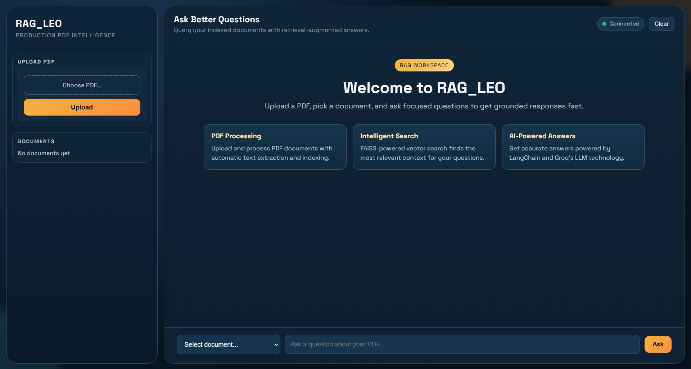
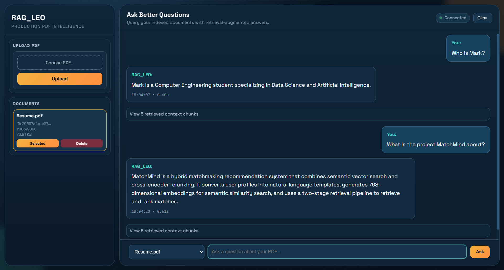

# RAG_LEO - Production-Grade RAG Document Q&A System

[](https://www.python.org/downloads/)
[](https://flask.palletsprojects.com/)
[](https://opensource.org/licenses/MIT)
[]()

## 📋 Overview

RAG_LEO is a **production-ready** Retrieval-Augmented Generation (RAG) system for PDF document Q&A. Built with **Flask**, **FAISS**, **LangChain**, and powered by **Groq's Llama 3 API**, it provides fast, accurate, and scalable document understanding.

### ✨ Key Features

- 🏗️ **Application Factory Pattern** - Modular, testable architecture
- 🗄️ **SQLAlchemy ORM** - SQLite by default, configurable via `DATABASE_URL`
- 🔒 **API Key Authentication** - Bearer token or `X-API-Key` header (optional)
- 🚦 **Rate Limiting** - 60 requests/min by default, fully configurable
- 🌐 **CORS Support** - Built-in Flask-CORS configuration
- 📝 **Pydantic v2 Validation** - Type-safe request/response schemas
- 🔍 **FAISS Vector Search** - Cosine similarity with persisted indexes
- 📈 **Structured Logging** - Rotating file + console logs, per-request timing
- 💊 **Health & Stats Endpoints** - Uptime, document counts, query metrics
- ✅ **pytest Test Suite** - Unit and integration tests with coverage reports

---

## 🖼️ Screenshots



---

## 🏗️ Architecture

```
┌─────────────────────────────────────────────────────────┐
│                   RAG_LEO Flask App                      │
│  ┌──────────────┐  ┌──────────────┐  ┌──────────────┐  │
│  │   Routes     │  │   Services   │  │  Middleware  │  │
│  └──────────────┘  └──────────────┘  └──────────────┘  │
│  ┌──────────────┐  ┌──────────────┐  ┌──────────────┐  │
│  │   Models     │  │   Schemas    │  │  Extensions  │  │
│  └──────────────┘  └──────────────┘  └──────────────┘  │
└────────────────┬──────────────────────────┬─────────────┘
                 │                          │
     ┌───────────▼────────┐      ┌──────────▼───────┐
     │   SQLite Database  │      │   FAISS Index    │
     │   (SQLAlchemy ORM) │      │   (Vectors +     │
     │   rag_leo.db       │      │    Metadata)     │
     └────────────────────┘      └──────────────────┘
```

---

## 📁 Project Structure

```
RAG_LEO/
├── app.py                      # Application entry point & route definitions
├── requirements.txt            # Python dependencies
├── pyproject.toml              # Tool configuration (black, pytest, mypy)
├── .env                        # Environment variables (not committed)
├── rag_leo.db                  # SQLite database (created at runtime)
│
├── src/                        # Application package
│   ├── __init__.py
│   ├── config.py               # Pydantic settings (reads .env)
│   ├── database.py             # SQLAlchemy session management
│   ├── exceptions.py           # Custom exception hierarchy
│   ├── extensions.py           # Flask extensions init (CORS, etc.)
│   ├── logger_config.py        # Rotating file + console logging
│   ├── middleware.py           # Request validation & sanitization
│   ├── models.py               # SQLAlchemy ORM models
│   ├── rag_pipeline.py         # FAISS + SentenceTransformers + Groq
│   ├── schemas.py              # Pydantic request/response schemas
│   ├── services.py             # Business logic layer
│   └── utils.py                # File helpers, directory utilities
│
├── templates/                  # Jinja2 HTML templates
│   ├── base.html
│   ├── index.html
│   ├── admin.html
│   └── error.html
├── static/
│   ├── css/main.css
│   └── js/
│       ├── app.js
│       └── config.js
│
├── tests/
│   ├── conftest.py
│   ├── test_app.py
│   ├── test_models.py
│   └── test_schemas.py
│
├── uploads/                    # Uploaded PDFs (auto-created)
├── indexes/                    # FAISS index files (auto-created)
├── metadata/                   # Chunk metadata pickles (auto-created)
├── logs/                       # Rotating log files (auto-created)
└── temp/                       # Temporary processing files
```

---

## 🚀 Quick Start

### Prerequisites

- Python 3.11+
- Groq API Key ([Get one here](https://console.groq.com/))

### 1. Clone the Repository

```bash
git clone <repository-url>
cd RAG_LEO
```

### 2. Create a Virtual Environment

```bash
python -m venv venv
# Windows
venv\Scripts\activate
# Linux/macOS
source venv/bin/activate
```

### 3. Install Dependencies

```bash
pip install -r requirements.txt
```

### 4. Configure Environment Variables

Create a `.env` file in the project root:

```env
# Required
GROQ_API_KEY=your-groq-api-key-here
SECRET_KEY=your-random-secret-key-here

# Optional — API key auth (leave API_KEYS blank to disable)
API_KEY_ENABLED=True
API_KEYS=key1,key2

# Optional overrides
GROQ_MODEL_NAME=llama-3.3-70b-versatile
DATABASE_URL=sqlite:///rag_leo.db
FLASK_DEBUG=False
```

### 5. Run the App

```bash
python app.py
```

Visit: [http://localhost:5000](http://localhost:5000)

---

## 🔑 Environment Variables

| Variable | Required | Default | Description |
|---|---|---|---|
| `GROQ_API_KEY` | ✅ | — | Groq API key |
| `SECRET_KEY` | ✅ | — | Flask secret key |
| `API_KEY_ENABLED` | ❌ | `True` | Enable API key auth |
| `API_KEYS` | ❌ | `""` | Comma-separated valid API keys |
| `DATABASE_URL` | ❌ | `sqlite:///rag_leo.db` | SQLAlchemy database URL |
| `GROQ_MODEL_NAME` | ❌ | `llama-3.3-70b-versatile` | Groq model to use |
| `EMBED_MODEL_NAME` | ❌ | `sentence-transformers/all-MiniLM-L6-v2` | Embedding model |
| `CHUNK_SIZE` | ❌ | `1000` | Text chunk size (characters) |
| `CHUNK_OVERLAP` | ❌ | `200` | Chunk overlap (characters) |
| `TOP_K_RETRIEVAL` | ❌ | `5` | Chunks retrieved per query |
| `LLM_TEMPERATURE` | ❌ | `0.3` | Generation temperature |
| `LLM_MAX_TOKENS` | ❌ | `1024` | Max tokens in response |
| `MAX_CONTENT_LENGTH` | ❌ | `16777216` | Max upload size (16 MB) |
| `RATE_LIMIT_ENABLED` | ❌ | `True` | Enable rate limiting |
| `RATE_LIMIT_PER_MINUTE` | ❌ | `60` | Requests per minute limit |
| `LOG_LEVEL` | ❌ | `INFO` | Logging level |

---

## 🌐 API Endpoints

| Endpoint | Method | Auth Required | Description |
|---|---|---|---|
| `/` | GET | No | Main web UI |
| `/admin` | GET | No | Admin dashboard |
| `/api/v1/health` | GET | No | Health check |
| `/api/v1/documents` | GET | Yes | List all documents |
| `/api/v1/upload` | POST | Yes | Upload a PDF |
| `/api/v1/ask` | POST | Yes | Query a document |
| `/api/v1/document/<doc_id>` | DELETE | Yes | Delete a document |
| `/api/v1/stats` | GET | Yes | System statistics |

Authentication is via `Authorization: Bearer <key>` or `X-API-Key: <key>` header.
Auth is skipped when `API_KEY_ENABLED=False`.

---

## 💬 Example Usage

Examples below assume `API_KEY_ENABLED=True`. Omit the `-H "X-API-Key"` header if auth is disabled.

### 1️⃣ Upload a PDF
```bash
curl -X POST \
  -H "X-API-Key: your-api-key" \
  -F "file=@report.pdf" \
  http://localhost:5000/api/v1/upload
```

**Response:**
```json
{
  "message": "Document uploaded and indexed successfully",
  "doc_id": "123e4567-e89b-12d3-a456-426614174000",
  "filename": "report.pdf",
  "chunks_count": 45,
  "text_length": 12500,
  "file_size": 524288,
  "processing_time_seconds": 1.23
}
```

### 2️⃣ Ask a Question
```bash
curl -X POST \
  -H "X-API-Key: your-api-key" \
  -H "Content-Type: application/json" \
  -d '{
    "query": "What are the key insights from the report?",
    "doc_id": "123e4567-e89b-12d3-a456-426614174000",
    "top_k": 5
  }' \
  http://localhost:5000/api/v1/ask
```

**Response:**
```json
{
  "answer": "The report highlights that renewable energy investments have grown by 25% in the last year.",
  "retrieved_chunks": [
    "Renewable energy investments increased by 25%...",
    "Solar energy accounted for 60% of growth..."
  ],
  "doc_id": "123e4567-e89b-12d3-a456-426614174000",
  "filename": "report.pdf",
  "query": "What are the key insights from the report?",
  "chunks_retrieved": 5
}
```

### 3️⃣ List All Documents
```bash
curl -H "X-API-Key: your-api-key" http://localhost:5000/api/v1/documents
```

### 4️⃣ Delete a Document
```bash
curl -X DELETE \
  -H "X-API-Key: your-api-key" \
  http://localhost:5000/api/v1/document/123e4567-e89b-12d3-a456-426614174000
```

### 5️⃣ Health Check (no auth)
```bash
curl http://localhost:5000/api/v1/health
```

**Response:**
```json
{
  "status": "healthy",
  "app_name": "RAG_LEO",
  "version": "2.0.0",
  "environment": "production",
  "uptime_seconds": 3600.5,
  "documents_count": 3,
  "queries_count": 42,
  "database_status": "healthy",
  "pipeline_status": "healthy",
  "disk_usage_mb": 45.2,
  "timestamp": "2026-03-11T10:00:00"
}
```

### 6️⃣ System Statistics
```bash
curl -H "X-API-Key: your-api-key" http://localhost:5000/api/v1/stats
```

**Response:**
```json
{
  "total_documents": 10,
  "total_queries": 150,
  "total_chunks": 450,
  "active_documents": 8,
  "average_processing_time_seconds": 1.45,
  "average_query_time_ms": 820.5,
  "storage_used_mb": 78.3,
  "uptime_seconds": 7200.0
}
```

---

## 🧠 Model Details

### Embedding Model
**`sentence-transformers/all-MiniLM-L6-v2`** (default)
- Runs locally on CPU
- Produces 384-dimensional semantic vectors
- Fast and efficient for similarity search
- Configurable via `EMBED_MODEL_NAME`

### Generation Model (via Groq API)
**`llama-3.3-70b-versatile`** (default) — configurable via `GROQ_MODEL_NAME`

| Model | Speed | Quality |
|---|---|---|
| `llama-3.1-8b-instant` | Fastest | Good |
| `llama-3.1-70b-versatile` | Moderate | High |
| `llama-3.3-70b-versatile` | Moderate | Best (recommended) |

### Vector Index
**FAISS `IndexFlatIP`**
- Cosine similarity search (inner product on L2-normalised vectors)
- Top-K retrieval per query (default K=5)
- Index and metadata persisted to `indexes/` and `metadata/` directories

---

## ⚙️ Configuration

All settings live in `src/config.py` and are read from the `.env` file via Pydantic `BaseSettings`. Key RAG parameters:

| Setting | Default | Description |
|---|---|---|
| `CHUNK_SIZE` | `1000` | Text chunk size in characters |
| `CHUNK_OVERLAP` | `200` | Overlap between consecutive chunks |
| `TOP_K_RETRIEVAL` | `5` | Chunks retrieved per query |
| `LLM_MAX_TOKENS` | `1024` | Max tokens in generated answer |
| `LLM_TEMPERATURE` | `0.3` | Sampling temperature (0.0–2.0) |
| `GROQ_MODEL_NAME` | `llama-3.3-70b-versatile` | Groq model to use |
| `LLM_TIMEOUT` | `30` | Groq API timeout in seconds |
| `LLM_MAX_RETRIES` | `2` | Groq API retry attempts |

---

## 🧩 Example Workflow

1️⃣ **Upload** — User POSTs `annual_report.pdf` to `/api/v1/upload`  
2️⃣ **Extract** — PyPDF2 extracts all text from the PDF pages  
3️⃣ **Chunk** — `RecursiveCharacterTextSplitter` splits text into 1000-char chunks with 200-char overlap  
4️⃣ **Embed** — SentenceTransformers encodes each chunk into a 384-dim vector  
5️⃣ **Index** — FAISS builds a searchable index; index + metadata are saved to disk  
6️⃣ **Store** — Document record saved to SQLite with chunk count, file size, processing time  
7️⃣ **Query** — User POSTs `{"doc_id": "...", "query": "What was the revenue growth?"}` to `/api/v1/ask`  
8️⃣ **Retrieve** — Top-5 most similar chunks fetched via FAISS cosine search  
9️⃣ **Generate** — Groq Llama 3 generates an answer from the retrieved chunks  
🔟 **Respond** — Answer and source chunks returned; query logged to database  

---

## 📊 Performance

- **PDF Processing:** ~1–2 seconds depending on file size
- **Query Response:** ~1–3 seconds (dominated by Groq API latency)
- **Embedding Generation:** ~0.5 seconds per 32 chunks (CPU, SentenceTransformers)
- **Response time header:** Every API response includes `X-Response-Time` (ms)

### Groq API Cost
- **Free Tier:** 14,400 requests/day
- **Paid:** Pay-as-you-go (~$0.05–$0.20 per 1M tokens)
- **Embeddings:** Free — runs locally

---

## 🔒 Security

- **API key auth** — All `/api/v1/*` routes (except `/health`) require a valid API key when `API_KEY_ENABLED=True`. Keys are compared using `hmac.compare_digest` to prevent timing attacks.
- **File validation** — Only PDF files are accepted; filename is sanitized via `werkzeug.utils.secure_filename`.
- **Rate limiting** — Built-in per-minute rate limiting (default 60 req/min) configurable via `RATE_LIMIT_PER_MINUTE`.
- **CORS** — Controlled via `CORS_ORIGINS` setting.
- **Never commit `.env`** — It contains `GROQ_API_KEY` and `SECRET_KEY`. The `.gitignore` should include:
  ```
  .env
  uploads/
  indexes/
  metadata/
  rag_leo.db
  ```

---

## 🧪 Testing

```bash
# Run full test suite with coverage
pytest

# Run with verbose output
pytest -v

# Run a specific test file
pytest tests/test_app.py
```

Test configuration is in `pyproject.toml`. Coverage reports are generated in `htmlcov/`.

---

## 📈 Potential Enhancements

- Multi-document cross-query (query across all uploaded documents)
- Source citation with PDF page numbers
- Support for DOCX and TXT file formats
- Streaming responses for real-time UI updates
- Redis-backed caching and rate limiting for multi-worker deployments
- User authentication and per-user document isolation
- Celery worker for async document processing

---

## 🐛 Troubleshooting

**`GROQ_API_KEY not found`** — Ensure `.env` exists in the project root and contains `GROQ_API_KEY=...`.

**`SECRET_KEY` error on startup** — `SECRET_KEY` is required. Add it to `.env`.

**`401 Unauthorized` on API calls** — Either add `X-API-Key: <key>` header, or set `API_KEY_ENABLED=False` in `.env`.

**`rate_limit_error` from Groq** — You have hit the free tier limit. Wait and retry, or upgrade to a paid Groq plan.

**PDF extraction returns empty text** — The PDF may be image-based (scanned). PyPDF2 only handles text-layer PDFs.

**`FAISS index not found` on query** — The index files in `indexes/` may have been deleted. Re-upload the document.

**Slow embedding on first run** — SentenceTransformers downloads the model (~90 MB) on first use. Subsequent runs use the local cache.

---

## 📚 References

- [Groq API Documentation](https://console.groq.com/docs)
- [LangChain Documentation](https://python.langchain.com/)
- [FAISS Documentation](https://github.com/facebookresearch/faiss)
- [SentenceTransformers](https://www.sbert.net/)
- [Flask Documentation](https://flask.palletsprojects.com/)

---

## 🧑‍💻 Author
**Gijode**

---

## 🤝 Contributing
Contributions are welcome! Feel free to open issues and submit pull requests.

---

## 📜 License
This project is licensed under the **MIT License** — see the [LICENSE](LICENSE) file for details.

---